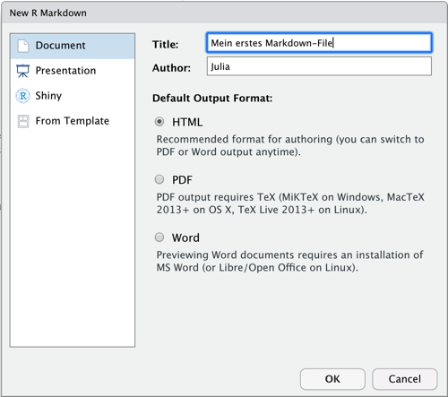
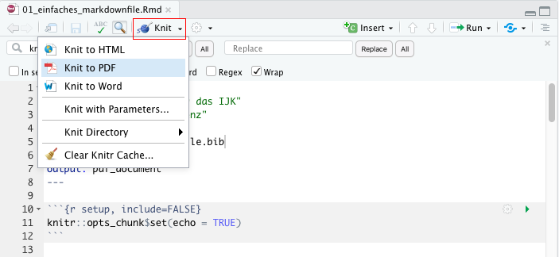

```{r setup, include=FALSE}
knitr::opts_chunk$set(echo = TRUE)
```

## R Markdown
Hallo! In dieser kleinen Demo möchte ich euch die Möglichkeiten von R Markdown aufzeigen.
Mit R Markdown kann man Dokumente schreiben, die sowohl den Text als auch den Code sowie statistische Analysen enthalten und die sich in viele verschiedene Output-Formate exportieren lassen (z. B. HTML-Webseiten, PDFs oder Word). 
So kann man z. B. aus RStudio heraus Berichte, Präsentationen oder Bücher erstellen, die jeweils aktuelle Analysen enthalten. R Markdown ist eine sehr einfache Auszeichnungssprache, die gut lesbar und auch leicht zu erlernen ist. In diesem File demonstriere ich Euch die Basics. :)

## Markdown-Datei anlegen
Eine neue Markdowndatei (Dateiendung .Rmd) könnt ihr in RStudio ganz einfach über das Menü anlegen:

> "File" > "new File" > "R Markdown" 



Im Pop-Up links könnt ihr auswählen, welches Template benutzt werden soll (z.B. "Document" für einen Bericht). 
Neben Berichten/Textseiten kann man auch Präsentationen mit R Markdown bauen oder interaktive Outputs mit Shiny. 
Dazu einfach das gewünschte anklicken, wenn ihr die Datei anlegt.
Man kann selbstverständlich auch eigene Templates erstellen oder R-Pakete laden, die Templates enthalten. Aber bleiben wir erstmal bei einem einfachen, textlastigen Dokument mit R-Output.


Oben könnt ihr schon mal den Titel des Dokuments eintagen und euren Namen. 
Das könnt ihr auch später immer noch nachholen oder wieder ändern. Weiter untern könnt ihr auswählen, in welches Dateiformat eure Markdowndatei standardmäßig gerendert werden soll. 
Zur Auswahl stehen HTML (Website), PDF und Word. 
Das ist nur der Standard, ihr könnt aus derselben Datei auch immer Outputs in den anderen Formaten erzeugen. 

Dieses "Erzeugen" heißt bei R Markdown übrigens "Knit" oder "knitten" (vom Englischen to knit, man strickt sich als ein Dokument aus dem Markdown-File). 

Klickt dazu einfach oben auf den Knit-Button in RStudio und wählt aus, welche Art Output erstellt werden soll (siehe Screenshot). Zum erstellen eines *PDFs* sind leider ein paar (einmalig durchzuführende) Vorarbeiten nötig. Euer Rechner braucht dazu "Tex". -- Das ist ein System zum Textsatz, mit dem man eben auch PDFs schreiben kann. 
* Wenn ihr bereits Tex auf Eurem System habt, weil ihr z.B. schon mal mit \LaTeX gerabeitet habt, dann müsst ihr RStudio den Pfad zu eurer Tex-Installation mitteilen. Wenn es der Standardpfad ist, geht es möglicherweise auch automatisch.
* Wenn ihr noch kein Tex habt, kann es sein, dass RStudio die entsprechenden Pakete automatisch installiert sobald ihr auf den Butten klickt (das kann dan möglicherweise ein Weilchen dauern). Sollte das nicht klappen, installiert bitte das R-Paket tinytex und versucht es nochmal. Achtung, kontrolliert bitte, ob die Installation von tinytex geklappt hat. Eventuell funktioniert es nicht beim ersten Mal.



Das "Knitten" geht natürlich auch mit diesem Demo-File. Es ist super einfach, probiert es aus! Wenn alles gut geht, dauert es ein bischen und es laufen viele Meldungen durch die Console (im Tab "R Markdown") und der Output wird in eurem Arbeitsverzeichnis gespeichert. 
Der öffnet sich entweder ganz automatisch oder ihr müsst im Ordner drauf klicken.

## Basic Markdown-Formatierungen
Mit Markdown kann man natürlich alle möglichen Formatierungen im Text machen. Die Sprache ist sehr leicht zu lernen, denn einfache Schreib- und Lesbarkeit ist ihre Philosophie (mehr dazu [hier](https://markdown.de/)). 

Man kann **fetten** und *kursiv* stellen, Text ^hoch^ stellen oder Formeln einfügen $A = \pi*r^{2}$ usw.

> Man kann kann Text hervorheben, indem man ihn in einem Blockquote einrückt.

### Hier eine Überschrift kleinerer Ebene

### Hier ein paar Listen
* Man kann
    * ungeordnete
    * Listen erstellen.
 
1. Oder auch 
    1. geordnete 
    2. Listen, 
2. wie diese hier.
  
Für einen neuen Absatz muss man übrigens am Ende der Zeile zwei Leerzeichen machen. 
Oder man macht einfach eine Leerzeile im Markdownfile. Im Output wird dies dann als neuer Absatz formatiert.

Selbstverständlich kann man auch Links einfügen, entweder so <http://rmarkdown.rstudio.com> oder so [Link zum Reference Guide](https://rstudio.com/wp-content/uploads/2015/03/rmarkdown-reference.pdf). 
Im ersten Link, bei RStudio findet ihr übrigens eine gute Einführung in R Markdown, die natürlich viel umfangreicher ist als diese Demo hier. 
Im zweiten Link ist eine Referenz, in der ihr noch viel mehr Formatierungsmöglichkeiten findet.


## R Code in R
Man kann im Markdownfile R-Code schreiben, der ausgeführt wird, wenn das Markdownfile geknitted wird.
Das macht man so:

```{r cars}
summary(cars)
```

Ok, dieser Output ist jetzt nicht sooo hübsch, aber natürlich, man kann auch viel längeren, komplexeren und tolleren R-Code einfügen, so dass es richtig schön wird. Ist ja nur eine Demo hier.

Und auch in den Zeilen kann man auf Inhalte aus R zugreifen bzw. diese auch dynamisch erzeugen. 
Hier lasse ich bspw. einen Mittelwert berechnen: *M* = `r mean(cars$speed)`.
\pagebreak

### Grafiken einfügen

Selbstredend kann man mittels R-Code auch Grafiken direkt in den Report einbauen:

```{r pressure, echo = FALSE, fig.height = 4}
plot(pressure)
```

Der Befehl `echo = FALSE` in dieser Zelle sorgt übrigens dafür, dass der R-Code nicht mit geknittet wird, sondern nur die Grafik. 
Das geht selbstverständlich auch bei allen anderen Code-Schnipseln.

### Tabellen
Per Default-Einstellung gibt R MArkdown Tabellen so aus, wie sie in der Console dargestellt würden, also so:
```{r show table}
head(mtcars, 5)
```

Für eine schönere Formatierung der Tabellen gibt es viele Lösungen, ein guter Einstieg ist das paket knitr, das man wie folgt einsetzt:
```{r knitr table}
knitr::kable(
  head(mtcars, 5),
  caption = "Tabelle mit knitr"
)
```

# Zitieren
In der Gallery bei RStudio <http://rmarkdown.rstudio.com> findet ihr ganz viele Beispiele für tolle Markdown-Outputs. 
Darunter sind auch interaktive Dashboards und sogar ganze Bücher.

Appropos Bücher. Natürlich gibt es gaaaanz viel Literatur zum Thema. Neben dem bereits bekannten R4DS von @Wickham.2017[Kapitel 27] möchte ich hier insbesondere auf "R Markdown: The definitive guide" und -- ganz neu -- das "R Markdown Cookbook" hinweisen [@Xie.2018; @Xie.2020]. 
Aber die bereits mehrfach erwähnte Website von RStudio liefert auch einen umfangreichen Einstieg sowie ein praktisches Cheat Sheet. 

Damit die Datei auch ein Literaturverzeichnis hat, muss man auf eine BibTeX-Datei verweisen[^my_footnote]. 
BibTeX ist ein standardisiertes Format für den Austausch von Literaturquellen. 
So eine Datei könnt ihr zum Beispiel mit Citavi erzeugen (über Datei > Exportieren). 
Legt die Datei einfach im Arbeitsverzeichnis von R ab. 
Ganz oben im Markdown-Dokument (im "YAML Header") macht ihr dann den Verweis auf die Datei.
Habe ich in diesem Dokument auch gemacht (`bibliography: my_bibtexfile.bib`). 
Den Namen müsst ihr natürlich anpassen.
In der Zeile danach habe ich den Zitierstil umgestellt auf den der Zeitschrift Publizistik (`csl: publizistik.csl`). Solche csl-Dateien, die den Zitationsstil formatieren, könnt ihr bspw. ganz einfach über <https://www.zotero.org/styles> recherchieren. Das Literaturverzeichnis wird automatisch beim knitten am Ende des Outputs erzeugt.

[^my_footnote]: Ok, es geht auch anders. Aber das hier ist ein prima Weg.

# Ausblick
Natürlich kann man R Markdown auch so anpassen, dass Text und Literaturverzeichnis im APA-Stil ausgegeben werden (Demo folgt). Es gibt sogar ein eigenes R-Paket, dass sich damit beschäftigt. Man kann den *Stil* eines Dokumentes sehr einfach wechseln und viele Journals bieten sogar Vorlagen an, mit deren Hilfe das Umformatieren auf die spezifischen Satz-Anforderungen und Zitierweisen eines Journals einfach wird.

R Markdown ist mit \LaTeX verzahnt und deshalb kann man die \LaTeX-Befehle nutzen z.B. so: \textit{kursiv}. Damit sind dann noch viel mehr Formatierungen, z. B. bei mathematischen Formeln und sogar professioneller Satz möglich (z. B. automatische [Ligaturen](https://de.wikipedia.org/wiki/Ligatur_(Typografie)), mein Typografie-Herz schlägt höher!). - Damit sehen eure Berichte dann sogar toller aus als mit MS Word... Man kann auch Markdown und \LaTeX im gleichen Dokument benutzen, wie hier geschehen.

Und selbstverständlich kann man mit R Markdown Präsentationen, Webseiten oder ganze (interaktive) Bücher schreiben (bookdown). Verschränkt mit weiteren Technologien werden auch interaktive Inhalte in den Dateien möglich (z.B. mit jupyter notebooks, shiny apps).

# Literaturverzeichnis